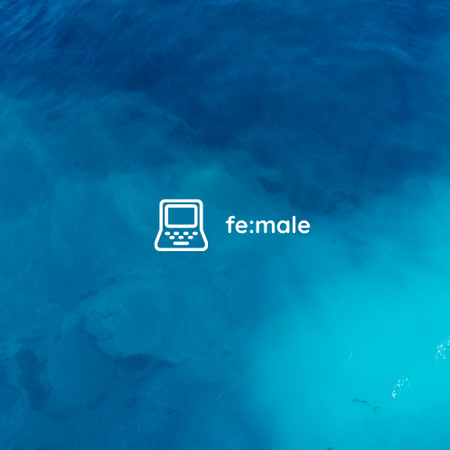

<a href="https://trishop.vercel.app">
  

    
  

</a>

<h1 style="color: CornflowerBlue;" align="center">
  fe:male
</h1>

  <strong style="font-style: italic;">Hacktiv8 Internship Final Project - Team 2</strong>

---

## Deployment 🌏

Deployed to [Netlify](https://female-ecommerce.netlify.app/)

## What is fe:male ❓

fe:male adalah final project dari Team 2 yang beranggotakan Tri Rizeki Rifandani dan Vera. Project ini merupakan project dari program kampus merdeka internship 2021 di Hacktiv8. Project ini bertemakan E-Commerce yang mengambil data dari external API di [FakeStoreAPI](www.fakestoreapi.com). Durasi pengerjaan project dilaksanakan dalam batas waktu 3 minggu.

## Tech Stack 🎲

1. Next.js 12 + `eslint` + `husky` + `lint-staged`
2. SEO dengan `next-seo`
3. External API call ke [FakeStoreAPI](www.fakestoreapi.com) dengan `axios`
4. UI Library menggunakan `react-bootstrap`
5. State management menggunakan `@reduxjs/toolkit`
6. Peyimpanan data ke Local Storage

## Design 📝

Selain itu, kami juga menyempatkan diri untuk mendesign mockup dari aplikasi nya di [Figma](https://www.figma.com/file/RNkxypPR3HRmJjpzr4ZV1B/Wireframing-in-Figma?node-id=0%3A1)

## Usage 🏀

Untuk menjalankan project ini di local, ikuti langkah berikut:

1. Clone repo ini
2. Jalankan `yarn install` atau `npm install`
3. Jalankan `yarn dev` atau `npm run dev` untuk menjalankan Next.js frontend di port `3000`
